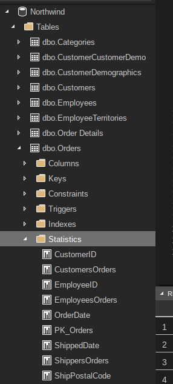
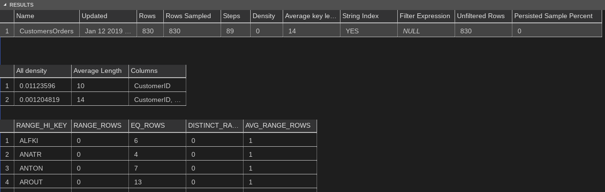
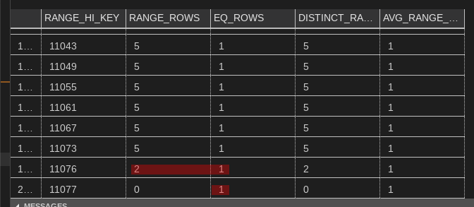

# Statistics

Let's understand query statistics and how it is used for query optimization.

Statistics help query optimizer choose the right `operators` in an execution plan. E.g. if the estimation of number of rows is less, then an `Index Seek` with `Key Lookup` is beneficial than a `Clustered Index Scan`.

Imagine the contrary, i.e. choosing an execution plan with `Key Lookup` for a query returning large number of rows.

## Reading

Some resources to learn about sql server statistics:
* Brent Ozar's training about Statistics (cost: free) - [link](https://www.brentozar.com/training/statistics-sql-servers-guessing-game)
* [SQL Passion Quickie #34](https://www.sqlpassion.at/archive/2016/04/04/sql-server-quickie-34-statistics/) talks about Statistics
* 

## Setup

We are using the [northwind][] database for this article. Please set it up in your machine if you want to try the queries for yourself.

[northwind]: ../datasets/northwind.md

## Tasks
### Understanding statistics

- Two kinds of statistics
    + Automatically created by SQL Server. Names start with `_WA_Sys_` for columns. For indexes, name of statistics is same as name of the index.
    + User created statistics can be named anything

- Statistics can be seen in SSMS or Azure Data Studio under the `Table | Statistics` node



Or use this query
```sql
SELECT *
FROM sys.stats AS s
WHERE s.object_id = OBJECT_ID('Orders');
```

Just in case Statistics for `Orders` table is not updated ever, let's update it.

```sql
UPDATE STATISTICS [dbo].[Orders] WITH FULLSCAN;
```

### Show details of a specific statistics

```sql
DBCC SHOW_STATISTICS('Orders', 'CustomersOrders');
```



Interpretation of Statistics Table
* `Rows` tells number of rows in the statistics, `Rows Sampled` denotes number of rows read to create the statistics (it is possible to create statistics without reading *all rows*)
* `Steps` number of entries the Histogram contains
* `Average key length` is length of the key for the statistics
* `Unfiltered Rows` is number of rows returned without any filter applied (if stats has a filter, `Rows != Unfiltered Rows`)

Interpretation of Density Vector
* `All Density` 

Interpretation of Histogram
* `RANGE_HI_KEY` determines the boundary of each *step* in the Histogram. N+1 th entry is the next highest value after Nth entry.
* `RANGE_ROWS` is number of rows around the `RANGE_HI_KEY` value. `EQ_ROWS` is number of rows which match `RANGE_HI_KEY`. Values are approximations
* `DISTINCT_RANGE_ROWS` is number of distinct values which fall in the range rows
* `AVG_RANGE_ROWS` (number of range rows/number of distinct range rows)

### Cardinality estimator

It is the component of SQL engine query optimizer which takes the Statistics data and creates row estimates.

#### Single column statistics
Try the histogram first
- Value matches `RANGE_HI_KEY`
    + Estimated rows = `EQ_ROWS`
- Value doesn't match `RANGE_HI_KEY`
    + Estimated rows = `AVG_RANGE_ROWS` of the nearest `RANGE_HI_KEY` row

Try the density vector next - blind guess on how many rows will be returned
- Estimated rows = Density Vector * Number of rows

```sql
SET STATISTICS XML ON;  
GO

SELECT *
FROM [dbo].[Orders]
WHERE [OrderID] > 11073
OPTION (RECOMPILE);
GO
```

We can see the Statistics Usage in Execution Plan. Look for something like
```xml
<OptimizerStatsUsage>
    <StatisticsInfo LastUpdate="2019-01-12T11:32:17.18" ModificationCount="0" SamplingPercent="100" Statistics="[PK_Orders]" Table="[Orders]" Schema="[dbo]" Database="[Northwind]"></StatisticsInfo>
</OptimizerStatsUsage>
```

Find the estimated row count (`EstimatedRowsRead`)
```xml
<RelOp NodeId="0" PhysicalOp="Clustered Index Seek" LogicalOp="Clustered Index Seek" EstimateRows="4" EstimatedRowsRead="4" EstimateIO="0.003125" EstimateCPU="0.0001614" AvgRowSize="231" EstimatedTotalSubtreeCost="0.0032864" TableCardinality="830" Parallel="0" EstimateRebinds="0" EstimateRewinds="0" EstimatedExecutionMode="Row">
```

Now look at the Histogram of `PK_Orders` statistics. Let's try to compute the rows `> 11073`.
```sql
DBCC SHOW_STATISTICS('Orders', 'PK_Orders');
```



Note the highlighted, there are `2` rows in `> 11076` range, `1` row in `= 11076` and `1` row in `= 11077`. Total `4` rows, which is exactly the `EstimatedRowsRead`. 

#### Multiple column statistics

#### Updating a statistics

```sql
UPDATE STATISTICS 
```

### 2. Histograms and densities


### 3. Multicolumn statistics


### 4. Sampling percentage

### 5. Statistics updates and plan invalidation?

> When you update statistics and data hasn’t changed, your plans won’t recompile. This is sensible.
> When you update statistics and change your histograms, your plans may not recompile if they’re trivial and simple parameterized, or parameterized in a stored procedure.

Reading: https://www.brentozar.com/archive/2018/08/what-kind-of-statistics-updates-invalidate-plans/

